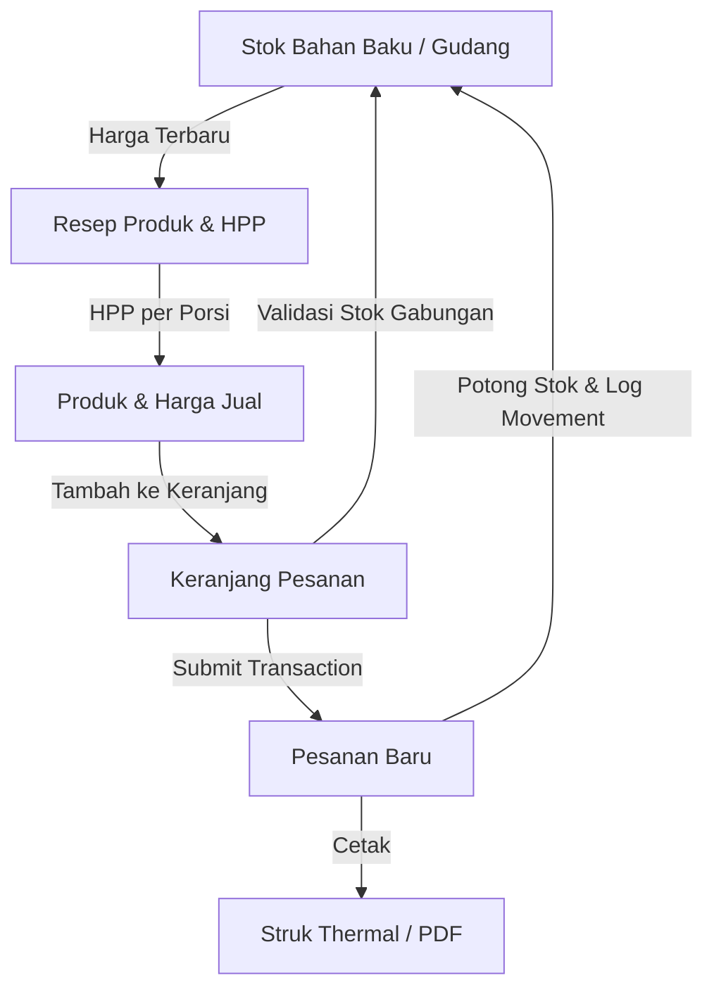

# Rencana Pembangunan Aplikasi POS & Inventory (HPP, Gudang, Pesanan, Struk)

Aplikasi ini dirancang untuk usaha makanan skala UMKM/rumahan guna mengelola HPP, stok bahan baku, pesanan multi-item, dan pencetakan struk menggunakan PostgreSQL (Neon) dan Drizzle ORM.

## 1. Ringkasan Sistem & Hubungan Antar Fitur
Sistem ini mengintegrasikan 4 modul utama secara real-time:
- **Kalkulasi HPP**: Mengambil harga terbaru dari *Gudang Bahan Baku* untuk menghitung biaya per porsi berdasarkan resep dinamis.
- **Gudang (Stok Bahan Baku)**: Menyimpan jumlah stok saat ini. Stok dikurangi secara otomatis ketika pesanan baru dibuat, dan dikembalikan jika pesanan dibatalkan.
- **Pencatatan Pesanan**: Kasir menginput pesanan multi-item. Sistem memvalidasi ketersediaan stok gabungan bahan baku sebelum mengizinkan penyimpanan pesanan. Pembuatan pesanan diproses di dalam database transaction.
- **Cetak Struk**: Menghasilkan struk thermal (58mm/80mm) untuk transaksi yang berhasil disimpan, mendukung pencetakan langsung menggunakan `window.print()` (Chrome kiosk printing).



---

## 2. Struktur Folder Project (Next.js App Router)
```text
/
├── docs/
│   ├── PLAN.md              # Rencana ini
│   └── tasks.json           # Daftar task granular
├── src/
│   ├── app/                 # Next.js App Router
│   │   ├── (auth)/          # Rute Login/Register
│   │   ├── dashboard/       # Halaman utama admin & kasir
│   │   │   ├── page.tsx     # Dashboard summary & chart
│   │   │   ├── ingredients/ # CRUD & movement bahan baku
│   │   │   ├── products/    # CRUD produk, resep, HPP
│   │   │   ├── orders/      # Pencatatan pesanan, detail, pembatalan
│   │   │   └── reports/     # Laporan & export CSV/Excel
│   │   ├── api/             # API Routes
│   │   │   └── auth/        # API Better Auth
│   │   ├── layout.tsx       # Root layout
│   │   └── page.tsx         # Landing page / redirect
│   ├── components/          # Reusable UI Components (Dialog, Receipt, Chart, dsb.)
│   ├── db/                  # Database & Drizzle Config
│   │   ├── schema.ts        # Skema tabel database
│   │   └── index.ts         # Inisialisasi DB client
│   ├── lib/                 # Utilitas, helper, Better Auth client
│   │   ├── auth.ts          # Better Auth setup
│   │   └── utils.ts         # Utility functions
│   └── hooks/               # Custom SWR atau React Query hooks
├── drizzle.config.ts        # Konfigurasi Drizzle
├── package.json
├── tsconfig.json
├── tailwind.config.ts
└── .env.example             # Contoh environment variables
```

---

## 3. Ringkasan Arsitektur Data & Alur Transaksi
### Database Schema Relations
- **`ingredients` 1 ── * `product_recipes`**: Hubungan bahan baku yang digunakan dalam resep produk.
- **`products` 1 ── * `product_recipes`**: Satu batch resep produk terdiri dari beberapa bahan baku.
- **`products` 1 ── * `order_items`**: Menyimpan snapshot item yang dibeli dalam pesanan.
- **`orders` 1 ── * `order_items`**: Satu pesanan memiliki beberapa item pesanan.
- **`ingredients` 1 ── * `stock_movements`**: Audit trail pergerakan stok bahan baku.

### Alur Transaksi (Database Transaction)
Semua perubahan stok dibungkus dalam `db.transaction(...)`:
1. **Pembuatan Pesanan**:
   - Ambil data resep untuk semua produk dalam keranjang.
   - Hitung total kebutuhan bahan baku secara gabungan.
   - Kunci/baca stok bahan baku saat ini. Jika tidak cukup, abort transaction dengan error.
   - Dapatkan nomor struk unik baru menggunakan tabel `order_counters` secara atomic:
     `INSERT ... ON CONFLICT DO UPDATE ... RETURNING lastSeq`
   - Potong stok di tabel `ingredients`.
   - Catat baris di `stock_movements` dengan tipe `'order'` (qty negatif).
   - Insert ke tabel `orders` dan `order_items`.
2. **Pembatalan Pesanan**:
   - Ubah status pesanan di `orders` menjadi `'cancelled'`.
   - Ambil semua `order_items` dan resep terkait untuk mengembalikan stok.
   - Tambah stok kembali di tabel `ingredients`.
   - Catat baris baru di `stock_movements` dengan tipe `'return'` (qty positif).

---

## 4. Urutan Pengerjaan
1. **Setup Project & Database**: Inisialisasi Next.js, pasang dependencies, setup Drizzle schema, koneksi ke Neon Postgres, jalankan migrasi awal.
2. **Setup Autentikasi (Better Auth)**: Registrasi user, setup session, role admin/kasir, proteksi middleware/rute API.
3. **CRUD Gudang Bahan Baku**: Integrasi input stok (restock) dan penyesuaian (adjustment) dengan audit trail `stock_movements`.
4. **CRUD Produk & HPP**: Form resep dinamis, kalkulasi otomatis HPP per porsi berdasarkan harga bahan terbaru secara real-time.
5. **Pencatatan Pesanan (Kasir)**: UI Keranjang belanja, validasi stok gabungan sebelum submit, db transaction untuk checkout.
6. **Struk/Nota & Printer Setup**: Halaman print dengan styling `@media print` 58mm/80mm, petunjuk Kiosk Printing Chrome.
7. **Dashboard & Laporan**: Grafik omzet, status stok menipis, export CSV/Excel.

---

## 5. Keputusan Desain & Asumsi
- **HPP Terkini (Current HPP)**: Menggunakan harga bahan baku terbaru saat kalkulasi. Untuk UMKM, ini paling praktis dibanding weighted average.
- **Soft-Delete**: Bahan baku dan produk tidak dihapus permanen agar data pesanan masa lalu tetap konsisten secara relasional. Cukup di-set `isActive = false`.
- **Better Auth / Auth Sederhana**: Menggunakan session-based authentication atau credentials provider Better Auth agar mudah dikonfigurasi dan aman untuk kasir/admin.
