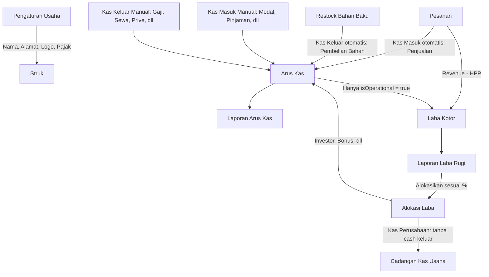

# Rencana Fase 2 — Pengaturan Usaha, Arus Kas & Laba Rugi

Lanjutan dari Fase 1 (HPP, Gudang, Pesanan, Struk — sudah selesai). Fase 2 fokus menambahkan lapisan bisnis: identitas usaha yang terintegrasi ke struk, pencatatan arus kas usaha secara menyeluruh (bukan cuma beban operasional), dan laporan laba-rugi yang akurat.

> **Catatan migrasi**: Pengaturan Usaha dan tabel `expenses` (versi sederhana — kas keluar operasional saja) sudah diimplementasikan dan jalan di production (T020–T029). Migrasi ke `cash_transactions` (T030–T040) dan fitur Alokasi Laba (T041–T047) juga sudah selesai dikerjakan. Bagian Pembulatan di bawah ini masuk sebagai T049–T055 (T048 sudah kepakai duluan untuk bugfix cetak struk).

## 1. Ringkasan Fitur & Hubungan Antar Modul

- **Pengaturan Usaha**: Data identitas bisnis (nama, alamat, logo, dll) jadi single source of truth yang dipakai di struk — menggantikan data hardcoded dari Fase 1.
- **Arus Kas (Cash Transactions)**: Ledger kas masuk & keluar usaha secara menyeluruh — bukan cuma biaya operasional. Kas masuk dari penjualan tercatat otomatis, ditambah kas masuk manual (modal, pinjaman, pendapatan lain) dan kas keluar manual (gaji, sewa, listrik, bayar utang, prive, dll). Setiap transaksi ditandai apakah dia mempengaruhi Laba Rugi (`isOperational`) atau cuma mempengaruhi posisi kas.
- **Laporan Laba Rugi**: Revenue (dari `orders`) − HPP − Kas Keluar yang `isOperational = true` = Laba Bersih.
- **Laporan Arus Kas**: Saldo Awal + Σ Kas Masuk − Σ Kas Keluar = Saldo Akhir, terpisah dari Laba Rugi karena mengukur pergerakan uang, bukan untung/rugi usaha.
- **Alokasi Laba (Profit Sharing)**: Laba Bersih per periode bisa dipecah sesuai persentase yang diatur di Pengaturan Usaha (misal Kas Perusahaan, Investor, Gaji, Bonus) — bagian yang beneran keluar dari kas (Investor, Bonus, dll) otomatis tercatat sebagai kas keluar di Arus Kas, sementara bagian yang tetap mengendap di kas usaha (Kas Perusahaan) cuma dicatat sebagai label alokasi tanpa mengurangi saldo kas.



## 2. Skema Database Tambahan (Drizzle)

### `business_settings` (singleton — selalu 1 baris)

```
id                    serial primary key
businessName          text not null
address               text
phone                 text
logoUrl               text
receiptFooterNote     text                          -- custom, misal "Terima kasih sudah order!"
taxEnabled            boolean not null default false
taxPercent            numeric not null default 0
serviceChargeEnabled  boolean not null default false
serviceChargePercent  numeric not null default 0
currencySymbol        text not null default 'Rp'
defaultReceiptSize    text not null default '58mm'  -- '58mm' | '80mm'
roundingEnabled       boolean not null default false
roundingNearest       numeric not null default 100  -- kelipatan pembulatan: 100 / 500 / 1000
updatedAt             timestamp not null default now()
```

### `cash_transactions` (ledger arus kas — menggantikan `expenses`)

```
id             serial primary key
type           text not null                    -- 'in' | 'out'
category       text not null                    -- lihat daftar kategori di bawah
isOperational  boolean not null default true    -- true: ngaruh ke Laba Rugi, false: cuma ngaruh posisi kas
description    text not null
amount         numeric not null
date           date not null
note           text
sourceType     text not null default 'manual'   -- 'manual' | 'order' | 'restock'
sourceRefId    text                             -- order_number atau id stock_movements, null kalau manual
createdBy      integer references users(id)
createdAt      timestamp not null default now()
```

**Kategori Kas Masuk (`type = 'in'`)**: Penjualan (`sourceType = 'order'`, otomatis — read-only di UI, bukan input manual), Modal Disetor (`isOperational = false`), Pinjaman (`isOperational = false`), Pendapatan Lain-lain (`isOperational = true`)

**Kategori Kas Keluar (`type = 'out'`)**: Gaji (`isOperational = true`), Sewa (`isOperational = true`), Listrik (`isOperational = true`), Transport (`isOperational = true`), Pembelian Bahan Baku (`sourceType = 'restock'`, otomatis, `isOperational = true` — sudah terhitung juga secara tidak langsung lewat HPP, jadi ini murni buat keperluan arus kas bukan Laba Rugi, lihat catatan di Keputusan Desain), Pembelian Aset (`isOperational = false`), Bayar Utang (`isOperational = false`), Prive/Ambilan Pribadi Owner (`isOperational = false`), Lainnya (default `isOperational = true`, bisa diubah manual)

Default `isOperational` per kategori di atas cuma nilai awal yang di-suggest form — admin tetap bisa override manual kalau ada kasus khusus.

### Perubahan pada `orders` (Fase 1)

Tambahan kolom:

```
taxAmount           numeric not null default 0
serviceChargeAmount numeric not null default 0
roundingAdjustment  numeric not null default 0   -- grandTotal - revenueTotal; negatif = dibulatkan ke bawah, positif = ke atas
grandTotal          numeric not null              -- revenueTotal + roundingAdjustment — ini yang BENERAN dibayar & masuk kas
```

`revenueTotal` (kolom lama) tetap dihitung `subtotal - discount + taxAmount + serviceChargeAmount` **sebelum pembulatan** — dipakai untuk `profitTotal` (`revenueTotal - hppTotal`) supaya margin per order/produk tetap akurat dan tidak keganggu oleh pembulatan receh. `grandTotal` yang jadi acuan uang diterima kas dan kembalian cash.

## 3. Alur Kunci

### Struk Terintegrasi Pengaturan Usaha

- Halaman cetak struk membaca `business_settings` (bukan hardcoded), tampilkan logo (kalau ada), nama usaha, alamat, footer note custom
- Kalau `taxEnabled`/`serviceChargeEnabled`, baris pajak/service charge muncul di struk sebelum total

### Pembulatan Total Pembayaran

- Kalau `roundingEnabled` aktif di Pengaturan Usaha, saat checkout sistem hitung `grandTotal` pakai aturan **round half up**: `grandTotal = floor(revenueTotal / roundingNearest + 0.5) * roundingNearest` — sisa < separuh kelipatan dibulatkan ke bawah, sisa ≥ separuh kelipatan (termasuk yang PERSIS separuh) dibulatkan ke atas. Contoh kelipatan 100: Rp15.540 → Rp15.500 (sisa 40, ke bawah), Rp15.560 → Rp15.600 (sisa 60, ke atas), Rp15.550 → Rp15.600 (sisa persis 50, ke atas). Lalu `roundingAdjustment = grandTotal - revenueTotal`
- **Pembulatan ke bawah** (`roundingAdjustment` negatif, contoh −40): usaha "melepas" selisih itu — diperlakukan sebagai pengurang Laba Bersih di Laporan Laba Rugi (baris "Selisih Pembulatan"), BUKAN mengurangi `revenueTotal`/margin produk
- **Pembulatan ke atas** (`roundingAdjustment` positif, contoh +40): usaha "dapat tambahan" — diperlakukan sebagai penambah Laba Bersih di baris yang sama
- Kalkulasi kembalian cash (`changeAmount = amountReceived - grandTotal`) pakai `grandTotal`, bukan `revenueTotal`
- Struk menampilkan baris "Sebelum Pembulatan: Rp{revenueTotal}" dan "Pembulatan: {+/-}Rp{roundingAdjustment}" sebelum baris "Total Bayar: Rp{grandTotal}" — supaya transparan ke pelanggan
- Kalau `roundingEnabled` nonaktif, `roundingAdjustment = 0` dan `grandTotal = revenueTotal`, baris pembulatan di struk disembunyikan

### Kas Masuk Otomatis dari Penjualan

- Saat order berhasil disimpan (status `paid`), sistem otomatis insert baris `cash_transactions`: `type = 'in'`, `category = 'Penjualan'`, `amount = grandTotal` (bukan `revenueTotal` — ini uang yang beneran diterima kas termasuk efek pembulatan), `sourceType = 'order'`, `sourceRefId = orderNumber` — dalam transaction yang sama dengan checkout
- Saat order dibatalkan (status jadi `cancelled`) padahal sudah kepakai sebagai kas masuk, sistem insert baris pembalik: `type = 'out'`, `category = 'Retur Penjualan'`, `amount = grandTotal`, `sourceType = 'order'`, `sourceRefId = orderNumber`

### Kas Keluar Otomatis dari Restock Bahan Baku

- Form restock bahan baku (Fase 1) ditambah field "Total Biaya Pembelian" (terpisah dari update harga per satuan)
- Saat restock disimpan, sistem insert baris `cash_transactions`: `type = 'out'`, `category = 'Pembelian Bahan Baku'`, `sourceType = 'restock'`, `sourceRefId` merujuk ke `stock_movements.id` terkait

### Pencatatan Manual (Kas Masuk & Kas Keluar)

- Form "Catat Transaksi Kas" (redesain dari "Catat Beban Operasional"): toggle **Kas Masuk / Kas Keluar** di paling atas, dropdown **Kategori** yang isinya berubah sesuai toggle (bukan free-text lagi), `isOperational` ke-set otomatis dari kategori tapi bisa di-override, field tanggal/deskripsi/jumlah/catatan tetap seperti desain awal

### Laporan Laba Rugi

1. Admin pilih rentang tanggal
2. Total Revenue (Σ `revenueTotal` order `paid`), Total HPP (Σ `hppTotal`), Laba Kotor = Revenue − HPP
3. Total Kas Keluar Operasional (Σ `cash_transactions.amount` where `type='out'` dan `isOperational=true`, breakdown per kategori)
4. Selisih Pembulatan (Σ `roundingAdjustment` order `paid` dalam periode — bisa positif atau negatif)
5. Laba Bersih = Laba Kotor − Total Kas Keluar Operasional + Selisih Pembulatan
6. Export ke PDF/Excel

### Laporan Arus Kas

1. Admin pilih rentang tanggal + saldo awal periode
2. Total Kas Masuk (Σ `cash_transactions` `type='in'`, breakdown per kategori & sumber otomatis/manual)
3. Total Kas Keluar (Σ `cash_transactions` `type='out'`, breakdown per kategori & sumber otomatis/manual)
4. Saldo Akhir = Saldo Awal + Total Kas Masuk − Total Kas Keluar
5. Export ke PDF/Excel

## 4. Urutan Pengerjaan

1. Tambah tabel `business_settings`, `cash_transactions` + kolom baru di `orders`, migrasi ke Neon
2. Halaman & API Pengaturan Usaha (admin-only) — termasuk upload logo
3. Integrasikan `business_settings` ke halaman cetak struk (ganti data hardcoded), tambahkan baris pajak/service charge di struk
4. Redesain UI form "Catat Transaksi Kas" — toggle Kas Masuk/Kas Keluar, dropdown kategori dinamis, auto `isOperational`
5. Implementasi API CRUD `cash_transactions` (entri manual)
6. Hook kas masuk otomatis dari penjualan ke alur checkout & pembatalan order yang sudah ada
7. Update form Restock Bahan Baku — tambah input biaya pembelian, auto-insert kas keluar kategori Pembelian Bahan Baku
8. Halaman Laporan Laba Rugi (agregasi revenue − HPP − kas keluar operasional)
9. Halaman Laporan Arus Kas (saldo berjalan, breakdown kategori & sumber)
10. Export kedua laporan ke PDF/Excel
11. Testing & polish

## 5. Keputusan Desain & Asumsi

- `business_settings` didesain sebagai singleton (1 baris) — cukup untuk 1 outlet usaha. Kalau nanti multi-outlet, ini perlu dipecah per-outlet (di luar scope Fase 2).
- "Kas" di sini merujuk ke saldo kas usaha secara keseluruhan (cash + QRIS + transfer digabung jadi satu posisi kas), bukan cuma uang fisik di laci — beda konsep dari Sesi Kasir (yang di-skip, fokus rekonsiliasi uang fisik per shift).
- Pembelian Bahan Baku dicatat sebagai kas keluar `isOperational = true` untuk keperluan Arus Kas, TAPI tidak ikut dihitung ulang di Laporan Laba Rugi (biaya bahan baku sudah terhitung lewat HPP per order) — dua laporan ini query dari sumber berbeda untuk menghindari biaya bahan dihitung dobel di Laba Rugi.
- Kategori `cash_transactions` tidak di-enum ketat di level DB, divalidasi di aplikasi — biar fleksibel kalau usaha butuh kategori baru tanpa migrasi ulang. Default `isOperational` per kategori bisa di-override manual saat input.
- Saldo awal Laporan Arus Kas diasumsikan diinput manual oleh admin sebagai baseline pertama kali laporan dipakai.

## 6. Alokasi Laba (Profit Sharing)

### `profit_allocation_rules` (bagian dari Pengaturan Usaha — aturan persentase pembagian laba)

```
id           serial primary key
label        text not null       -- 'Kas Perusahaan', 'Investor', 'Gaji', 'Bonus', atau custom
percentage   numeric not null    -- persentase dari Laba Bersih
isRetained   boolean not null default false   -- true = 'Kas Perusahaan' (uang tetap di kas, tidak generate kas keluar)
isActive     boolean not null default true
sortOrder    integer not null default 0
```

Total `percentage` dari rule yang `isActive = true` divalidasi harus = 100% di halaman Pengaturan (peringatan kalau belum pas).

### `profit_allocations` (histori eksekusi alokasi per periode)

```
id            serial primary key
periodStart   date not null
periodEnd     date not null
netProfit     numeric not null    -- snapshot Laba Bersih periode itu, dari Laporan Laba Rugi
status        text not null default 'confirmed'
createdBy     integer references users(id)
createdAt     timestamp not null default now()
```

### `profit_allocation_items` (breakdown per kategori, snapshot % saat dieksekusi)

```
id                    serial primary key
profitAllocationId    integer not null references profit_allocations(id)
label                 text not null       -- snapshot label kategori
percentage            numeric not null    -- snapshot % yang dipakai
amount                numeric not null    -- netProfit * percentage / 100
isRetained            boolean not null    -- snapshot, ikut logic sama seperti di rules
```

### Alur "Alokasikan Laba"

1. Admin atur dulu kategori & persentase di Pengaturan Usaha (misal: Kas Perusahaan 40%, Investor 20%, Gaji 20%, Bonus 20% — total harus 100%)
2. Di halaman Laporan Laba Rugi, admin pilih periode lalu klik "Alokasikan Laba" → sistem preview breakdown nominal per kategori berdasarkan Laba Bersih periode itu × persentase aktif saat ini
3. Admin konfirmasi → dalam satu transaction:
   - Insert `profit_allocations` (snapshot `netProfit`, periode)
   - Insert `profit_allocation_items` per kategori (snapshot label, %, amount, `isRetained`)
   - Untuk kategori dengan `isRetained = false` (Investor, Gaji, Bonus, dll — uang beneran keluar dari kas usaha): auto-insert `cash_transactions` `type='out'`, `isOperational=false`, `category` = label kategori, `sourceType='profit_allocation'`, `sourceRefId` = id `profit_allocations`
   - Untuk kategori `isRetained = true` (Kas Perusahaan): TIDAK generate `cash_transactions` — uangnya memang tetap di kas usaha, cuma "dilabeli" sebagai cadangan, jadi tidak mengurangi saldo Arus Kas
4. Halaman Riwayat Alokasi Laba menampilkan histori pembagian tiap periode

**Catatan penting**: "Gaji" dan "Bonus" di alokasi laba ini adalah **pembagian tambahan dari laba** (profit-sharing), bukan gaji pokok bulanan reguler — gaji pokok reguler tetap dicatat sebagai kas keluar operasional biasa di `cash_transactions` (kategori Gaji, `isOperational=true`). Kalau dua-duanya sama-sama disebut "Gaji", disarankan dikasih label beda di rules (misal "Gaji" vs "Bonus Gaji dari Laba") biar gak ketuker pas baca laporan.

## 7. Kantong Kas (Cash Pockets) — Alokasi Real-Time per Transaksi

> **Catatan migrasi**: Menggantikan alur "Alokasi Laba" manual (T041–T047) yang dieksekusi per-periode. `profit_allocation_rules`, `profit_allocations`, `profit_allocation_items` dipertahankan sebagai arsip histori — halaman "Riwayat Alokasi Laba" jadi read-only, tombol "Alokasikan Laba" di Laba Rugi dinonaktifkan. Ke depan, pembagian laba terjadi otomatis real-time tiap transaksi lewat sistem kantong ini.

### `cash_pockets` (definisi kantong + aturan persentase)

```
id           serial primary key
label        text not null         -- 'HPP (Bahan Baku)', 'Kas Perusahaan', 'Investor', 'Gaji', 'Bonus', atau custom
type         text not null         -- 'cost' (khusus HPP — dapet exact hppTotal per order) | 'profit_share' (dapet % dari profit)
percentage   numeric               -- hanya dipakai type='profit_share'; total semua profit_share aktif harus = 100%
isActive     boolean not null default true
sortOrder    integer not null default 0
createdAt / updatedAt
```

Selalu ada 1 pocket `type='cost'` bawaan (label default "HPP (Bahan Baku)") — tidak ikut hitungan 100% karena dia dapet nominal exact, bukan persentase.

### `pocket_transactions` (buku besar per kantong — sumber kebenaran saldo)

```
id             serial primary key
pocketId       integer not null references cash_pockets(id)
direction      text not null        -- 'credit' | 'debit'
amount         numeric not null
sourceType     text not null        -- 'order' (kredit otomatis penjualan) | 'cash_transaction' (debit pengeluaran) | 'manual_adjustment'
sourceRefId    text                 -- orderNumber atau cash_transactions.id
note           text
createdAt      timestamp not null default now()
```

Saldo kantong = `Σ amount WHERE direction='credit' − Σ amount WHERE direction='debit'`, dihitung real-time per query (belum perlu kolom cache balance di v1).

### Perubahan pada `cash_transactions`

Tambahan kolom:

```
pocketId   integer references cash_pockets(id)   -- wajib diisi untuk entri kas keluar (type='out'), null untuk kas masuk yang bukan hasil split otomatis
```

### Alur Kredit Otomatis (saat order `paid`)

Dalam transaction yang sama dengan checkout:

1. Insert `pocket_transactions` credit ke pocket `type='cost'`: `amount = hppTotal`, `sourceType='order'`, `sourceRefId=orderNumber`
2. Untuk tiap pocket `type='profit_share'` aktif: insert credit `amount = (revenueTotal − hppTotal) × percentage / 100`, `sourceType='order'`, `sourceRefId=orderNumber`
3. `roundingAdjustment` (dari fitur pembulatan) di-credit/debit-kan otomatis ke pocket "Kas Perusahaan" (asumsi default — selisih receh dianggap urusan cadangan kas usaha, bukan dibagi rata ke semua kantong)

### Alur Reversal (saat order dibatalkan)

Insert `pocket_transactions` **debit** pembalik untuk semua kredit yang sebelumnya masuk dari order tsb (HPP pocket & semua profit_share pocket terkait), `sourceType='order'`, `sourceRefId=orderNumber` — supaya saldo kantong gak nyisain "hantu" dari order yang batal.

### Alur Pengeluaran (kas keluar manual)

- Form "Catat Transaksi Kas" (kas keluar) ditambah dropdown **wajib**: "Ambil dari Kantong" — pilih salah satu `cash_pockets` aktif
- Sistem tampilkan saldo kantong terkini di dropdown itu (misal "Gaji (sisa Rp2.400.000)") biar kelihatan sebelum milih
- Kalau saldo kantong gak cukup, sistem **tetap izinkan simpan** tapi kasih warning visual (bukan block keras) — karena ini pembukuan internal, bukan rekening terpisah beneran
- Saat disimpan: insert `cash_transactions` seperti biasa + insert `pocket_transactions` debit ke pocket yang dipilih, `sourceType='cash_transaction'`, `sourceRefId` = id `cash_transactions`
- Pembelian Bahan Baku otomatis (dari restock) langsung ke-debit ke pocket `type='cost'` tanpa perlu pilih manual

### Halaman Baru: "Kantong Kas"

Dashboard saldo tiap kantong real-time (kartu per kantong: label, saldo saat ini, total masuk & keluar periode berjalan) + riwayat `pocket_transactions` per kantong dengan filter tanggal & sumber.

### Keputusan Desain & Asumsi (Kantong Kas)

- Pajak & service charge untuk sementara tetap masuk ke pool profit yang di-split ke `profit_share` pockets — belum dipisah jadi kantong sendiri (bisa jadi kandidat lanjutan kalau dibutuhkan)
- `roundingAdjustment` default masuk ke pocket "Kas Perusahaan", bukan dibagi ke semua kantong — asumsi ini bisa diubah kalau usaha lebih suka pembulatan dianggap bagian dari profit yang di-split rata
- Validasi saldo kantong bersifat _soft warning_, bukan hard block — sengaja begitu supaya alur pengeluaran gak keblokir cuma karena pembukuan internal belum sinkron

## 8. Pembersihan Database

**Aman dihapus** (sudah terduplikasi penuh di tempat lain, tidak ada referensi balik dari tabel manapun):

- `expenses` — sudah 100% termigrasi ke `cash_transactions` (T030–T031), semua laporan sudah baca dari sumber baru. Backup CSV dulu sebelum drop (T066).
- `profit_allocation_rules` — begitu isinya dimigrasi ke `cash_pockets` (T058), tabel config ini tidak dipakai lagi ke depan. Aman karena `profit_allocation_items` menyimpan snapshot `label`/`percentage` sendiri, tidak bergantung ke tabel ini.

**TIDAK boleh dihapus** (catatan keuangan riil, bukan sekadar config):

- `profit_allocations` + `profit_allocation_items` — histori eksekusi pembagian laba yang benar-benar sudah terjadi (uang sudah keluar ke investor/bonus). `cash_transactions` hasil eksekusinya masih menyimpan `sourceRefId` yang menunjuk ke sini — kalau dihapus, jejak alokasi laba masa lalu putus dan tidak bisa ditelusuri lagi.

## 9. Kandidat Fase 3 (belum dikerjakan, dicatat untuk roadmap)

- Sesi Kasir (buka/tutup shift, rekonsiliasi kas fisik) — di-skip dulu dari Fase 2
- Integrasi platform delivery (GoFood, ShopeeFood, dll) — butuh riset API partner masing-masing platform
- Supplier & Utang Pembelian Bahan Baku (accounts payable)
- Piutang Pelanggan (transaksi kredit/utang)
- Notifikasi WhatsApp (stok menipis, kirim struk digital ke pelanggan)
